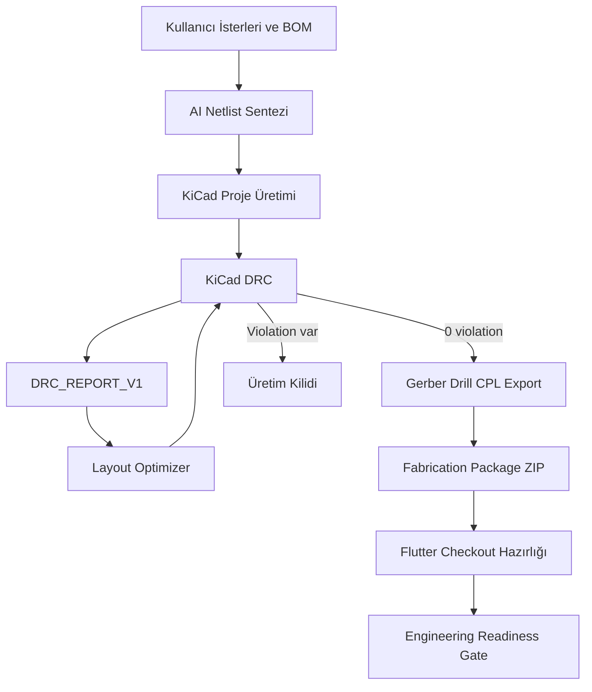

# OmniCircuit AI Ana Harita

Bu klasör, **OmniCircuit AI** projesinin Obsidian uyumlu proje hafızasıdır. Amaç, projenin ne yaptığını, hangi fazda hangi dosyanın üretildiğini, hangi güvenlik kapılarının bulunduğunu ve sonraki geliştirme adımlarını tek yerden takip edebilmektir.

> [!important] Üretim Güvenliği
> Bu sistem KiCad ile DRC=0 üretim paketi çıkarabilecek hale gelmiştir; ancak AC şebeke, RF empedans, izolasyon, komponent footprint doğruluğu ve üretici DFM gereksinimleri için nihai elektronik mühendis incelemesi zorunludur.

## Hızlı Bağlantılar

- [[01 - Sistem Özeti]]
- [[02 - Mimari ve Veri Akışı]]
- [[03 - Faz Takip Notları]]
- [[04 - KiCad ve Üretim Komutları]]
- [[05 - DRC ve Otonom Düzeltme Döngüsü]]
- [[06 - Güvenlik ve Üretime Hazırlık]]
- [[07 - Dosya ve Klasör Rehberi]]
- [[08 - Sonraki İşler]]
- [[09 - Faz 5 Üretim Checkout ve Paketleme]]
- [[10 - Mühendislik Gerçeklik Kapısı]]

## Mevcut Durum

| Alan | Durum |
| --- | --- |
| Flutter kontrol merkezi | Çalışıyor |
| AI netlist üretimi | Çalışıyor |
| KiCad 10 bridge | Çalışıyor |
| DRC parser | Çalışıyor |
| Closed-loop optimizer | Çalışıyor |
| Son DRC sonucu | 0 violation |
| Üretim export | Gerber, drill, position üretildi |
| Üretim checkout paketi | Çalışıyor |
| Dış API payload | Kaldırıldı, yerel paketleme kullanılıyor |
| Mühendislik gerçeklik kapısı | Çalışıyor, mevcut durum blocked |

## Ana Çıktılar

- KiCad PCB: `outputs/kicad/esp32_s3_dwm3000_uwb_anchor_with_relay_outputs/*.kicad_pcb`
- DRC raporu: `outputs/phase4/DRC_REPORT_V1_iteration_1.json`
- Optimizer durumu: `outputs/phase4/layout_optimization_status.json`
- Gerber: `outputs/phase4/gerber/`
- Drill: `outputs/phase4/drill/`
- Pick and Place: `outputs/phase4/position/pick_and_place.csv`
- Üretim ZIP: `outputs/fabrication/Quantum_Mind_Anchor_v2_4_Production.zip`
- Flutter üretim asset'i: `assets/generated/fabrication_package.json`
- Mühendislik denetimi: `outputs/engineering/engineering_readiness_report.json`

## Kavramsal Akış

## Günlük Kullanım

1. Flutter uygulamasını aç.
2. Ürün isterlerini, BOM bilgisini ve teknik notları gir.
3. `Tasarim Paketi Uret` ile netlist ve tasarım paketini oluştur.
4. KiCad bridge ve optimizer komutlarını çalıştır.
5. DRC sekmesinden üretim bayrağını ve hata durumunu takip et.
6. Faz 5 paketleme komutunu çalıştır.
7. Flutter'daki kamyon ikonundan üretim checkout ekranını aç.
8. ZIP paketini üretici paneline manuel yüklemeden önce dosya listesini, kart ölçüsünü, katman bilgisini ve tahmini maliyeti kontrol et.

İlgili komutlar için bkz. [[04 - KiCad ve Üretim Komutları]].
