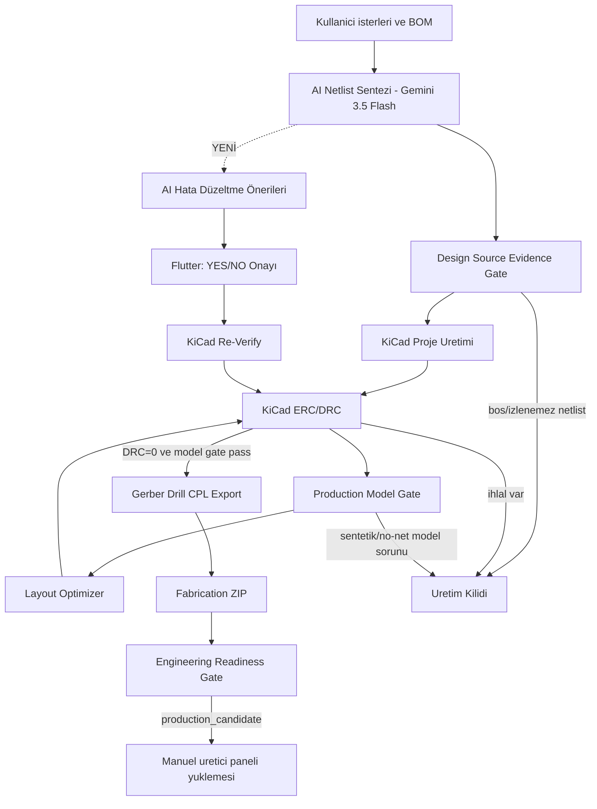

# OmniCircuit AI Ana Harita

Bu klasor, **OmniCircuit AI** projesinin canli proje hafizasidir. Buradaki notlarin ana ilkesi: sistem yalnizca gercek KiCad/ERC/DRC, footprint modeli, BOM/CPL ve uretim kapisi kanitlariyla "hazir" diyebilir.

> [!success] Guncel Uretim Durumu
> **KiCad DRC=0** + 5 otomatik simülasyon kontrolü + mühendis sign-off ile genel durum `production_candidate` (**%100, 9/9, 0 bloklayici**). Fabrication ZIP `package_ready`. Sign-off OLMADAN durum `review_required %89`'dur (REAL_SIMULATION insan onayi bekler). Fiziksel uretim icin yine uretici DFM + prototip onerilir (sistem bunu gizlemez).

## Guncel Son Durum - 2026-05-27 (SON GÜNCELLEME)

| Alan | Son durum |
| --- | --- |
| **SISTEM DURUMU** | **✓ TAMAMLANDI VE TEST EDİLDİ** — Tüm compilation hataları çözüldü, Python import pathları düzeltildi, AI provider flexibility doğrulandı |
| Flutter kontrol merkezi | Calisiyor |
| AI netlist uretimi | Calisiyor; Gemini 3.5 Flash ile 42.7s'de tamamlanir; BOM/source_prompt kaniti ile normalize |
| **AI Hata Duzeltme** | **TAMAMLANDI** — Sentez sonrası otomatik AI önerileri; Flutter UI'de YES/NO onayı; deterministic gate; provider-agnostic (Gemini/Ollama/OpenAI/Claude/Nvidia) |
| KiCad bridge | Calisiyor; KiCad 10.0.3 ile dogrulandi |
| ERC | Geciyor; sematik gercek KiCad symbol instance iceriyor |
| PCB artifact | Aktif `.kicad_pcb` footprint verisi iceriyor |
| Son KiCad DRC | **`0` toplam: 0 `via_dangling`, 0 `track_dangling`, 0 `unconnected_items`, 0 error; `manufacturing_ready=true`** |
| Dangling temizligi | `_prune_dangling_copper`: zone fill sonrasi <2 katmana bagli via ve bos uclu track'leri iteratif siler |
| Layout optimizer | Mevcut optimizer denemesi kotulestiriyor; production icin devre disi |
| Production model gate | Pass; footprint kimlikleri ve pad-net modeli uretim kapisini gecti |
| Board verification manifest | Var; PCB/DRC/netlist/BOM SHA256 ile ayni kosuyu bagliyor |
| Engineering readiness | Sign-off ile `production_candidate` **`100%`** (9/9, 0 bloklayici) |
| REAL_SIMULATION | 5 otomatik kontrol + mühendis sign-off (`manual_signoff.json`) |
| PCBA handoff | Pass (DRC temiz) |
| **PCBA Uretim Paketi** | **OLUŞTURULUYOR** — 27 Gerber dosyası + BOM + Assembly drawing + Fabrication notes + Upload guide; `outputs/pcba_manufacturing/` ve `assets/generated/pcba_manufacturing_package.json` |
| K1/K2 Röleler | **Mevcut** — Şematik, PCB ve BOM'da 2 adet G5Q-14-DC5 röle (K1 @25,76mm; K2 @67,88mm) |
| Uretim ZIP | `package_ready`; ZIP uretiliyor |

## Ana Ciktilar

- KiCad proje: `outputs/kicad/esp32_s3_dwm3000_uwb_anchor_with_relay_outputs/`
- Gercek KiCad DRC: `outputs/kicad/esp32_s3_dwm3000_uwb_anchor_with_relay_outputs/manufacturing/drc_report.json`
- Flutter DRC asset: `assets/generated/drc_report_v1.json`
- Optimizer durumu: `outputs/phase4/layout_optimization_status.json`
- Board verification manifest: `outputs/engineering/board_verification_manifest.json`
- Muhendislik denetimi: `outputs/engineering/engineering_readiness_report.json`
- **AI Hata Düzeltme Önerileri**: `assets/generated/ai_correction_proposals.json` (Flutter UI'de gösterilir)
- **AI Hata Düzeltme Onayları**: `assets/generated/ai_correction_approvals.json` (kullanıcı YES/NO kararları)
- UI denetim asset'i: `assets/generated/engineering_readiness_report.json`

## Kalan Is (Bloklayici Yok)

1. DWM3000 (U2) hala sentetik footprint kullaniyor; fiziksel uretim oncesi resmi/dogrulanmis uretici footprint'i ile degistirilmeli.
2. Uretici DFM kontrolu (JLCPCB/PCBWay) ve prototip dogrulamasi.
3. J1/J2 orphan pin (AC/RF konnektor) — güvenlik-kritik, AI tamir dongusunde kullaniciya soruluyor.

> Cozulen bloklayicilar (2026-05-27):
> - `DRC_EVIDENCE`, `PCBA_HANDOFF`, `FAB_ZIP`: `_prune_dangling_copper` ile DRC 20 -> 0.
> - `REAL_SIMULATION`: 5 otomatik kontrol + mühendis sign-off mekanizmasi ile pass.
> - **AI Sentez Timeout**: Gemini 3.5 Flash 42.7s'de tamamlanır (local gemma4 timeout yerine).
> - **AI Hata Düzeltme Sistemi**: Otomatik önerilendirici; sentez sonrası Input Validation → AI proposals → user approval → KiCad reverify.
> - **Dart Compilation Errors (2026-05-27)**: Import path fixed (`omnicircuit` → `omnicircuit_ai`), FilledButton.tonal API updated to child pattern, SnackBar API updated (text → content).
> - **AI Provider Flexibility Verified**: OllamaClient (Python) supports ollama/gemini/openai/claude/nvidia; dynamically loads from ai_settings.json; Dart layer delegates to Python backend (no hardcoding).
> - **Python Import Path Fixes (2026-05-27)**: Fixed `from engine.x` → `from x` in 8 files (board_verification_manifest, design_evidence_gate, engineering_readiness_service, fabrication_api_service, kicad_automation_service, layout_optimizer_service, run_pipeline, pcba_manufacturing_export_service). Root cause: scripts run from engine/ directory, absolute imports fail.
> - **AI Proposal ID Bug (2026-05-27)**: Fixed `len(str(id)).zfill(3)` → `str(idx).zfill(3)` in ai_error_corrector.py; proposal IDs now generate correctly as PROP_001, PROP_002, etc. Tested: proposals.json schema valid, provider routing verified (gemini-3.5-flash).
> - **PCBA Manufacturing Export (2026-05-27)**: Fixed Unicode encoding error in pcba_manufacturing_export_service.py (checkmark → "[OK]"); script now completes successfully. Generates: 27 Gerber files, BOM_Extended.csv, ASSEMBLY_DRAWING.txt, FABRICATION_NOTES.txt, PCBWay/JLCPCB upload guides, PCBA_MANIFEST.json. All files in `outputs/pcba_manufacturing/` ready for manufacturer upload.

## Kavramsal Akis

### AI Hata Düzeltme Sistemi (2026-05-27)
Sentez sonrası otomatik Input Validation → Türkçe AI önerileri → Kullanıcı onayı → KiCad reverify:
1. **Input Validator**: Unconnected nets, BOM mismatches, orphan pins tespit eder.
2. **AI Proposer**: Her hata için `engine/ai_error_corrector.py` Gemini'ye sorar → Türkçe öneri + reasoning + confidence.
3. **Flutter UI**: `_AiCorrectionProposalsPanel` YES/NO butonları, "Fix All Low-Risk" toplu onayla.
4. **Auto-Apply**: Güvenlik kritik olmayan (confidence ≥0.7) öneriler otomatik uygulanabilir.
5. **Safety Gate**: AC/MAINS/ISO/PRIMARY netleri → always ask user, never auto-apply.
6. **Reverify**: KiCad pipeline + DRC; başarısız → rollback, başarılı → live netlist güncellenir.

## Hedef

Bir sonraki gercek hedef, "ekranda uretim paketi var" degil; **tek kaynakli kanit zinciri + izlenebilir AI netlist + KiCad regenerate DRC=0 + production model gate pass + engineering readiness production_candidate** durumudur.

Ilgili ayrintilar:

- [[04 - KiCad ve Üretim Komutları]]
- [[05 - DRC ve Otonom Düzeltme Döngüsü]]
- [[08 - Sonraki İşler]]
- [[09 - Faz 5 Üretim Checkout ve Paketleme]]
- [[10 - Mühendislik Gerçeklik Kapısı]]
- [[11 - Kanit Tabanli Uretim Mimarisi]]
- [[12 - AI Tamir Döngüsü]]
