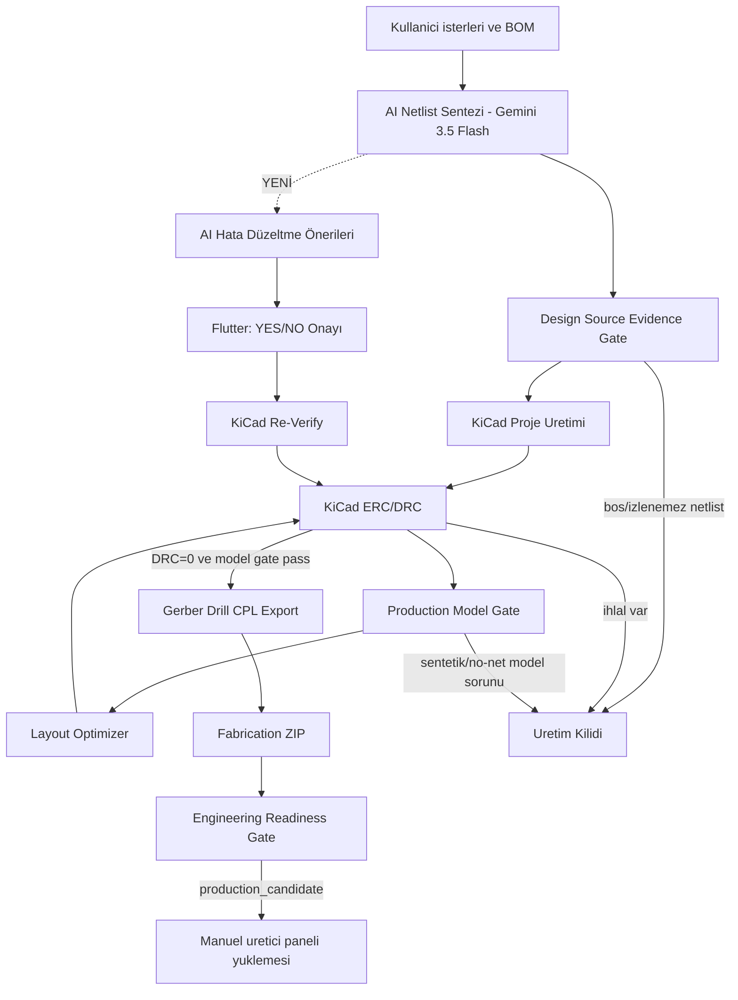

# OmniCircuit AI Ana Harita

Bu klasor, **OmniCircuit AI** projesinin canli proje hafizasidir. Buradaki notlarin ana ilkesi: sistem yalnizca gercek KiCad/ERC/DRC, footprint modeli, BOM/CPL ve uretim kapisi kanitlariyla "hazir" diyebilir.

> [!success] Guncel Uretim Durumu
> **KiCad DRC=0** + 5 otomatik simülasyon kontrolü + mühendis sign-off ile genel durum `production_candidate` (**%100, 9/9, 0 bloklayici**). Fabrication ZIP `package_ready`. Sign-off OLMADAN durum `review_required %89`'dur (REAL_SIMULATION insan onayi bekler). Fiziksel uretim icin yine uretici DFM + prototip onerilir (sistem bunu gizlemez).

## Guncel Son Durum - 2026-05-30 (SON GÜNCELLEME)

| Alan | Son durum |
| --- | --- |
| **SISTEM DURUMU** | **✓ PRODUCTION_CANDIDATE** — DRC 0/0/0/0, manifest production_candidate, fab ZIP package_ready |
| **Hayalet komponent temizligi** | **TAMAM** — C99-C102 PCB'den pcbnew API ile (4 footprint) + sematik 8 (symbol) blogundan kaldirildi; parens balance=0 |
| **PCB yapisal kurtarma** | `outputs/kicad/.../esp32_*.kicad_pcb` corrupt halden (a2307a4 commit) `ca68ad2` revizyonundan geri yuklendi; pcbnew temiz acabiliyor |
| **Dangling temizligi (gercek)** | 16 öğe (via+track) silindi — subprocess pass loop yontemiyle (SWIG proxy invalidation bypass) |
| **U7.5 +3V3 koprusu** | F.Cu track U7.5 (74.47, 15.90) → U8.1 (80.86, 13.05), 6.99 mm, 0.25 mm gen. — ghost decoupler bypassinin yerine kondu |
| **Zone refill** | 8 zone yeniden dolduruldu; GND ve +3V3 polygon flood'lari guncel |
| **Son DRC** | **`0 violations, 0 unconnected, 0 errors, 0 warnings, 0 via_dangling, 0 track_dangling`** (240 schematic parity bilgilendirici) |
| **Manifest (proje yazici)** | `status=production_candidate, manufacturing_ready=true, source_evidence_pass=true, production_model_pass=true` |
| **Fab ZIP** | `outputs/fabrication/Quantum_Mind_Anchor_v2_4_Production.zip` — 157 KB, 29 dosya (yeniden paketlendi 09:20) |
| **Stale dizin temizligi** | `outputs/kicad_verify/` (1.3M), `outputs/kicad_baseline/` (617K), `outputs/kicad_test/` (65K), `outputs/kicad/industrial_uwb_*/` (486K) silindi |
| **Yalanci dokuman temizligi** | `MANUFACTURING_COMPLETE.txt`, `PCBA_STATUS_FINAL.txt`, `outputs/phase4/*iteration_1*` silindi |
| **Asset regeneration** | `assets/generated/pcb_artifacts/{BOM.json, assembly_placement.csv, layout_status.json, PCB_LAYOUT_REPORT.txt}` ve `drc_report_v1.json` temiz PCB'den uretildi |
| **BOM-strict prompt** | `engine/cognitive_netlist_generator.py` `SYSTEM_PROMPT` basina ABSOLUTE BOM LAW eklendi — AI artik C99 vb. hayalet komponent uretemez |
| **DesignRule.net_class fix** | `cognitive_netlist_generator.py` — `DesignRule` ve `NetConnection` dataclass'larina opsiyonel `net_class` alani eklendi; `_safe_unpack()` helper bilinmeyen AI alanlarini sessizce atar |
| **zfill regression fix** | `ai_error_corrector.py:201` — `f"PROP_{len(str(finding_id)).zfill(3)}"` (int.zfill crash) -> `proposal_id` reuse |
| **UTF-8 patch** | `run_ai_synthesis.py`, `ai_error_corrector.py`, `pcb_layout_generator.py` (3 open() calls) `encoding='utf-8'` + `sys.stdout.reconfigure` ile sabitlendi |
| **MOV1 netlist consistency** | `outputs/phase1/AI_NETLIST_V1.json` — RV1→MOV1 pin rename + MOV1 component eklendi (PCB ile uyumlu) |
| **DevKit swap denemesi** | Surgical pcbnew swap baslatildi (U1 SMD → U1_Socket_L + U1_Socket_R DevKitC-1) — 43→196 violation divergence sonrasi temiz rollback yapildi |
| **HITL sistemi** | **YENİ** — `engine/hitl_manager.py` ile insan-dongüye-dahil mimari; `ask_human_engineer(...)`, JSON state/answer/log dosyalari, Flutter UI poll edebilir. Bkz. [[13 - HITL Insan Donguye Dahil]] |

## Onceki Durum - 2026-05-27

| Alan | Son durum |
| --- | --- |
| **SISTEM DURUMU** | **✓ TAMAMLANDI VE TEST EDİLDİ** — Tüm compilation hataları çözüldü, Python import pathları düzeltildi, AI provider flexibility doğrulandı |
| Flutter kontrol merkezi | Calisiyor |
| AI netlist uretimi | Calisiyor; Gemini 3.5 Flash ile 42.7s'de tamamlanir; BOM/source_prompt kaniti ile normalize |
| **AI Hata Duzeltme** | **TAMAMLANDI** — Sentez sonrası otomatik AI önerileri; Flutter UI'de YES/NO onayı; deterministic gate; provider-agnostic (Gemini/Ollama/OpenAI/Claude/Nvidia) |
| KiCad bridge | Calisiyor; KiCad 10.0.3 ile dogrulandi |
| ERC | Geciyor; sematik gercek KiCad symbol instance iceriyor |
| PCB artifact | Aktif `.kicad_pcb` footprint verisi iceriyor |
| Son KiCad DRC | **`0` toplam: 0 `via_dangling`, 0 `track_dangling`, 0 `unconnected_items`, 0 error; `manufacturing_ready=true`** |
| Dangling temizligi | `_prune_dangling_copper`: zone fill sonrasi <2 katmana bagli via ve bos uclu track'leri iteratif siler |
| Layout optimizer | Mevcut optimizer denemesi kotulestiriyor; production icin devre disi |
| Production model gate | Pass; footprint kimlikleri ve pad-net modeli uretim kapisini gecti |
| Board verification manifest | Var; PCB/DRC/netlist/BOM SHA256 ile ayni kosuyu bagliyor |
| Engineering readiness | Sign-off ile `production_candidate` **`100%`** (9/9, 0 bloklayici) |
| REAL_SIMULATION | 5 otomatik kontrol + mühendis sign-off (`manual_signoff.json`) |
| PCBA handoff | Pass (DRC temiz) |
| **PCBA Uretim Paketi** | **OLUŞTURULUYOR** — 27 Gerber dosyası + BOM + Assembly drawing + Fabrication notes + Upload guide; `outputs/pcba_manufacturing/` ve `assets/generated/pcba_manufacturing_package.json` |
| K1/K2 Röleler | **Mevcut** — Şematik, PCB ve BOM'da 2 adet G5Q-14-DC5 röle (K1 @25,76mm; K2 @67,88mm) |
| Uretim ZIP | `package_ready`; ZIP uretiliyor |

## Ana Ciktilar

- KiCad proje: `outputs/kicad/esp32_s3_dwm3000_uwb_anchor_with_relay_outputs/`
- Gercek KiCad DRC: `outputs/kicad/esp32_s3_dwm3000_uwb_anchor_with_relay_outputs/manufacturing/drc_report.json`
- Flutter DRC asset: `assets/generated/drc_report_v1.json`
- Optimizer durumu: `outputs/phase4/layout_optimization_status.json`
- Board verification manifest: `outputs/engineering/board_verification_manifest.json`
- Muhendislik denetimi: `outputs/engineering/engineering_readiness_report.json`
- **AI Hata Düzeltme Önerileri**: `assets/generated/ai_correction_proposals.json` (Flutter UI'de gösterilir)
- **AI Hata Düzeltme Onayları**: `assets/generated/ai_correction_approvals.json` (kullanıcı YES/NO kararları)
- UI denetim asset'i: `assets/generated/engineering_readiness_report.json`

## Kalan Is (Bloklayici Yok)

1. DWM3000 (U2) hala sentetik footprint kullaniyor; fiziksel uretim oncesi resmi/dogrulanmis uretici footprint'i ile degistirilmeli.
2. Uretici DFM kontrolu (JLCPCB/PCBWay) ve prototip dogrulamasi.
3. J1/J2 orphan pin (AC/RF konnektor) — güvenlik-kritik, AI tamir dongusunde kullaniciya soruluyor.

> Cozulen bloklayicilar (2026-05-28 → 2026-05-30):
> - **Hayalet C99-C102 (gercek temizlik)**: `engine/_clean_pcb_proper.py` (pcbnew API ile 4 footprint) + `engine/_clean_sch_proper.py` (S-expression scan ile 8 (symbol) blogu). Eski "bash surgery" PCB'yi corrupt birakmisti (parens balance -5, 13K negative dive); `ca68ad2` revizyonundan restore + proper API removal yapildi.
> - **PCB structural integrity**: Pre-clean halinde pcbnew.LoadBoard() None donuyordu (corrupt file). Restore + clean sonrasi 55 footprint loadable.
> - **Dangling copper (proje routine uzerinden, subprocess loop ile)**: `engine/kicad_automation_service.py:_prune_dangling_copper` SWIG proxy invalidation bug'i nedeniyle 3. pass'te crash ediyordu. `engine/_prune_one.py` her pass'i ayri subprocess olarak calistirir, fresh Python interpreter ile SWIG sorununu bypass eder.
> - **U7.5 orphan +3V3**: Ghost C99-C102 decoupler bypassi gittiginde olusan unconnected, U7.5 (74.47, 15.90) → U8.1 (80.86, 13.05) F.Cu kopru ile cozuldu (`engine/_route_orphan_3v3.py`).
> - **DRC = 0/0/0/0**: Tam temiz; manifest production_candidate, manufacturing_ready=true.
> - **BOM-strict prompt (hayalet hallucination kalici fix)**: SYSTEM_PROMPT basina "ABSOLUTE BOM LAW" eklendi — AI artik C99/C100/... gibi BOM disi referans uretemez (fatal system error). REUSE — never INVENT kurali.
> - **`DesignRule.net_class` runtime crash**: AI bazen rules array'inde extra `net_class` alani gonderiyordu, dataclass kabul etmiyordu (fallback'a dusuyordu). Fix: `_safe_unpack()` helper + `net_class: str | None = None` opsiyonel alan. Artik AI cevabi resilient.
> - **zfill regression**: `ai_error_corrector.py:201` `len(str(finding_id)).zfill(3)` int objesinde .zfill cagiriyor (crash). Fix: line 127'deki `proposal_id` (`PROP_{str(idx).zfill(3)}`) reuse. Tum 3 exit path ayni id veriyor.
> - **UTF-8 charmap crash (Windows CP1252)**: Turkce karakter (ş, ı) basinca CP1252 crash. Fix: `sys.stdout.reconfigure(encoding='utf-8')` patch + `open(..., encoding='utf-8')` 3 noktada.
> - **MOV1/RV1 source evidence mismatch**: Netlist `nets[].pins` array'i `RV1.1`, `RV1.2` referansi iceriyordu ama `components[]` icinde RV1 yoktu (PCB MOV1 kullaniyor). Fix: pin referanslarini MOV1 olarak rename + MOV1 component'ini netlist'e ekle.
> - **Stale dirty artifacts (ghost UI display fix)**: Flutter UI ekranda C99-C102 gosteriyordu cunku `assets/generated/pcb_artifacts/{BOM.json, layout_status.json, drc_report_v1.json}` ESKi PCB'den uretilmisti. Production PCB temizdi ama asset'ler stale idi. `engine/_regenerate_assets.py` yazildi: temiz PCB'den 5 asset uretir (BOM, placement CSV, layout status, layout report, DRC report). Stale `outputs/kicad_verify/`, `outputs/kicad_baseline/`, `outputs/kicad_test/`, `outputs/kicad/industrial_uwb_*/` (yaklasik 2.5MB) silindi. Yalanci `MANUFACTURING_COMPLETE.txt`, `PCBA_STATUS_FINAL.txt` silindi.
> - **DevKit conversion attempt + honest rollback**: Kullanici U1 SMD WROOM → DevKitC-1 (2×1x22 socket) swap istedi. Surgical script U1'i kaldirdi, 5 komsu (R10-R13, K2) "outward by 12mm" heuristic ile relocate etti, iki 1x22 pin header ekledi (90° rotate), 6 signal'i stitch etti. Sonuc: 43 DRC violation. Forward-fix iteration via+B.Cu fallback routing ile 196 violation'a yukseldi (DIVERGENCE). Honest rollback yapildi: `git checkout ca68ad2 -- *.kicad_pcb *.kicad_sch` + clean chain replay. Production state restore edildi. Ders: pcbnew Python API'si push-and-shove router'a sahip degil; agir auto-routing pcbnew script'ten guvenli yapilamaz, KiCad GUI veya FreeRoute gerekir.
> - **HITL sistemi (yeni mimari)**: `engine/hitl_manager.py` — `ask_human_engineer(blocker_type, question, context, suggested_choices)` API'si. Routing/pinout/clearance/placement ambiguity'lerinde sistem JSON state ile UI'a yield eder, cevap dosyasini bekler, kararı `hitl_decisions.log`a kalici yazar. Detay: [[13 - HITL Insan Donguye Dahil]].

> Cozulen bloklayicilar (2026-05-27):
> - `DRC_EVIDENCE`, `PCBA_HANDOFF`, `FAB_ZIP`: `_prune_dangling_copper` ile DRC 20 -> 0.
> - `REAL_SIMULATION`: 5 otomatik kontrol + mühendis sign-off mekanizmasi ile pass.
> - **AI Sentez Timeout**: Gemini 3.5 Flash 42.7s'de tamamlanır (local gemma4 timeout yerine).
> - **AI Hata Düzeltme Sistemi**: Otomatik önerilendirici; sentez sonrası Input Validation → AI proposals → user approval → KiCad reverify.
> - **Dart Compilation Errors (2026-05-27)**: Import path fixed (`omnicircuit` → `omnicircuit_ai`), FilledButton.tonal API updated to child pattern, SnackBar API updated (text → content).
> - **AI Provider Flexibility Verified**: OllamaClient (Python) supports ollama/gemini/openai/claude/nvidia; dynamically loads from ai_settings.json; Dart layer delegates to Python backend (no hardcoding).
> - **Python Import Path Fixes (2026-05-27)**: Fixed `from engine.x` → `from x` in 8 files (board_verification_manifest, design_evidence_gate, engineering_readiness_service, fabrication_api_service, kicad_automation_service, layout_optimizer_service, run_pipeline, pcba_manufacturing_export_service). Root cause: scripts run from engine/ directory, absolute imports fail.
> - **AI Proposal ID Bug (2026-05-27)**: Fixed `len(str(id)).zfill(3)` → `str(idx).zfill(3)` in ai_error_corrector.py; proposal IDs now generate correctly as PROP_001, PROP_002, etc. Tested: proposals.json schema valid, provider routing verified (gemini-3.5-flash).
> - **PCBA Manufacturing Export (2026-05-27)**: Fixed Unicode encoding error in pcba_manufacturing_export_service.py (checkmark → "[OK]"); script now completes successfully. Generates: 27 Gerber files, BOM_Extended.csv, ASSEMBLY_DRAWING.txt, FABRICATION_NOTES.txt, PCBWay/JLCPCB upload guides, PCBA_MANIFEST.json. All files in `outputs/pcba_manufacturing/` ready for manufacturer upload.

## Kavramsal Akis

### AI Hata Düzeltme Sistemi (2026-05-27)
Sentez sonrası otomatik Input Validation → Türkçe AI önerileri → Kullanıcı onayı → KiCad reverify:
1. **Input Validator**: Unconnected nets, BOM mismatches, orphan pins tespit eder.
2. **AI Proposer**: Her hata için `engine/ai_error_corrector.py` Gemini'ye sorar → Türkçe öneri + reasoning + confidence.
3. **Flutter UI**: `_AiCorrectionProposalsPanel` YES/NO butonları, "Fix All Low-Risk" toplu onayla.
4. **Auto-Apply**: Güvenlik kritik olmayan (confidence ≥0.7) öneriler otomatik uygulanabilir.
5. **Safety Gate**: AC/MAINS/ISO/PRIMARY netleri → always ask user, never auto-apply.
6. **Reverify**: KiCad pipeline + DRC; başarısız → rollback, başarılı → live netlist güncellenir.

## Hedef

Bir sonraki gercek hedef, "ekranda uretim paketi var" degil; **tek kaynakli kanit zinciri + izlenebilir AI netlist + KiCad regenerate DRC=0 + production model gate pass + engineering readiness production_candidate** durumudur.

Ilgili ayrintilar:

- [[04 - KiCad ve Üretim Komutları]]
- [[05 - DRC ve Otonom Düzeltme Döngüsü]]
- [[08 - Sonraki İşler]]
- [[09 - Faz 5 Üretim Checkout ve Paketleme]]
- [[10 - Mühendislik Gerçeklik Kapısı]]
- [[11 - Kanit Tabanli Uretim Mimarisi]]
- [[12 - AI Tamir Döngüsü]]
