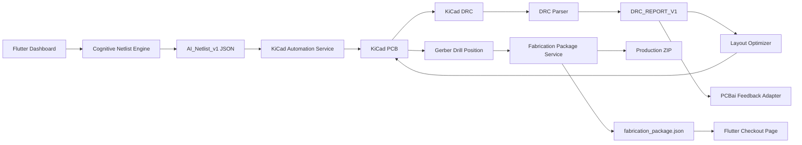

# Mimari ve Veri Akışı

## Katmanlar



## 1. Flutter Dashboard

Kullanıcı şu bilgileri girer:

- Ürün isterleri
- BOM veya komponent listesi
- Teknik notlar

Bu bilgiler elle yazılabilir veya dosyadan içe aktarılabilir. Girdi paneli şu dosya türlerini destekler:

- ister / teknik not: `.md`, `.txt`, `.csv`, `.json`, `.net`, `.xml`, `.yaml`, `.yml`, `.sch`, `.kicad_sch`
- BOM: `.csv`, `.tsv`, `.txt`, `.md`, `.json`, `.xml`, `.yaml`, `.yml`

Windows desktop kullanımında import penceresine doğrudan dosya yolu yazılabilir:

```text
C:\Mypcb\BOM.csv
C:\Mypcb\SCHEMATIC.md
C:\Mypcb\PCB_NOTES.md
```

`Yoldan Yukle` dosyayı okuyup ilgili metin alanına basar. `Gozat` ise işletim sisteminin dosya seçicisini açar.

Dashboard ayrıca şunları gösterir:

- AI mühendislik akışı
- sanal laboratuvar kontrolleri
- netlist önizleme
- şematik bloklar
- PCB kuralları
- PCBA yerleşim notları
- DRC analizörü
- üretim export durumu
- üretim checkout hazırlığı
- üretim ZIP dosyası, dosya listesi, kart ölçüsü ve yerel maliyet tahmini

## 2. Cognitive Netlist Engine

Dosya:

```text
engine/cognitive_netlist_generator.py
```

Üretilen ana format:

```text
AI_Netlist_v1
```

Bu format şunları taşır:

- komponentler
- net bağlantıları
- DRC/ERC kuralları
- AI reasoning log
- ERC summary

## 3. KiCad Automation Service

Dosya:

```text
engine/kicad_automation_service.py
```

Görevleri:

- `AI_Netlist_v1` dosyasını okumak
- KiCad proje dizini oluşturmak
- `.kicad_pro`, `.kicad_sch`, `.kicad_pcb` üretmek
- `pcbnew` ile footprint ve board nesnesi oluşturmak
- DWM3000 pad pitch değerini 1.0mm yapmak
- RF ve AC kurallarını board metadata / rule area olarak işlemek
- `kicad-cli` ile DRC ve export çalıştırmak

## 4. DRC Parser

Dosya:

```text
engine/drc_parser.py
```

Girdi:

```text
kicad-cli pcb drc --format json
```

Çıktı:

```text
DRC_REPORT_V1
```

Kategoriler:

- clearance
- unrouted
- keepout
- courtyard
- drill
- silkscreen
- other

## 5. Layout Optimizer

Dosya:

```text
engine/layout_optimizer_service.py
```

Kapalı döngü:

1. DRC çalıştır.
2. `DRC_REPORT_V1` üret.
3. Hata türlerini oku.
4. `pcbnew` ile board üzerinde düzeltme yap.
5. Board’u kaydet.
6. DRC=0 olana veya 5 iterasyona kadar tekrarla.
7. DRC=0 ise manufacturing export çalıştır.

## 6. PCBai Feedback Adapter

Dosya:

```text
engine/pcbai_feedback_adapter.py
```

Amaç:

DRC hatalarını PCBai veya ilerideki başka bir optimizer için penalty/constraint payload’una çevirmek.

Örnek mantık:

- clearance → koordinatları yay
- unrouted → net’i route et veya layer değiştir
- keepout → objeleri keepout dışına çıkar
- silkscreen → referans yazısını taşı/gizle

## 7. Fabrication Package Service

Dosya:

```text
engine/fabrication_api_service.py
```

Amaç:

Faz 4 sonunda üretilen Gerber, drill, pick-and-place ve BOM dosyalarını tek bir üretim ZIP paketinde toplamak ve Flutter arayüzüne `FABRICATION_PACKAGE_V1` özetini vermek.

> [!important]
> Son kararla bu servis dış üretici API payload'u üretmez ve herhangi bir yere otomatik veri göndermez. Sistem, güvenli tarafta kalmak için yerel üretim paketi ve checkout hazırlık özeti üretir.

Çıktılar:

- `outputs/fabrication/Quantum_Mind_Anchor_v2_4_Production.zip`
- `outputs/fabrication/fabrication_package.json`
- `assets/generated/fabrication_package.json`

Flutter sayfası:

```text
lib/manufacturing_dashboard.dart
```

Bu sayfa şunları gösterir:

- Gerber/Drill/CPL/BOM paket durumu
- kart ölçüsü
- 4 katman bilgisi
- üretici seçimi
- miktar seçimi
- solder mask rengi
- yerel tahmini maliyet ve süre

## Veri Formatları

| Format | Amaç |
| --- | --- |
| `AI_Netlist_v1` | Tasarımın elektriksel kaynak modeli |
| `DRC_REPORT_V1` | KiCad DRC hatalarının normalize edilmiş hali |
| `PCBAI_CONSTRAINT_FEEDBACK_V1` | PCBai optimizer için penalty listesi |
| `LAYOUT_OPTIMIZATION_RUN_V1` | Closed-loop optimizer sonucu |
| `FABRICATION_PACKAGE_V1` | Üretim ZIP paketi ve checkout hazırlık özeti |

İlgili fazlar için bkz. [[03 - Faz Takip Notları]].
