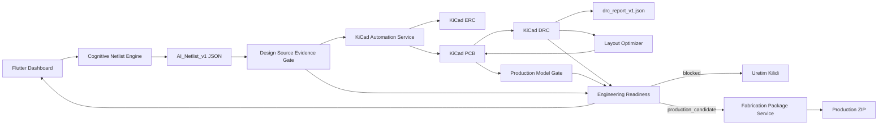

# Mimari ve Veri Akisi

## Guncel Ilke

Mimari artik "dosya uretildiyse hazirdir" mantigiyla calismaz. Uretim paketi yalnizca design source evidence, DRC, production model gate ve engineering readiness kapilari gecerken gecerli sayilir.

## Katmanlar



## 1. Flutter Dashboard

Kullanici su bilgileri girer:

- urun isterleri
- BOM veya komponent listesi
- teknik notlar

Girdi paneli `.md`, `.txt`, `.csv`, `.json`, `.net`, `.xml`, `.yaml`, `.yml`, `.sch`, `.kicad_sch` gibi dosyalari ilgili metin alanlarina yukleyebilir.

Dashboard su alanlari gosterir:

- AI muhendislik akisi
- netlist onizleme
- KiCad/DRC durumu
- optimizer durumu
- uretim checkout ekrani
- engineering readiness sonucu

Guncel UI'da uretim dosyalari gorunse bile son gate `blocked` ise bunlar uretime onay sayilmaz.

## 2. Cognitive Netlist Engine

Dosya:

```text
engine/cognitive_netlist_generator.py
```

Ana cikti:

```text
outputs/phase1/AI_NETLIST_V1.json
```

Bu format komponentleri, netleri, gerekceleri ve constraint notlarini tasir.

Guncel durum:

```text
Aktif AI_NETLIST_V1.json dolu komponent ve net listesi tasiyor.
DESIGN_SOURCE_EVIDENCE=pass.
```

## 3. KiCad Automation Service

Dosya:

```text
engine/kicad_automation_service.py
```

Gorevleri:

- `AI_Netlist_v1` dosyasini okumak
- KiCad proje dizini olusturmak
- `.kicad_pro`, `.kicad_sch`, `.kicad_pcb` uretmek
- footprint yuklemek veya eksikse bloklanacak sentetik fallback uretmek
- pin-pad eslemelerini yapmak
- KiCad CLI ile ERC/DRC calistirmak

Son duzeltmeler:

- `R10-R13` gruplanmis refleri `R10`..`R13` olarak aciliyor.
- `J1` gercek Phoenix terminal block footprint'e baglandi.
- `J1/J2/U2/U7` pin alias eslemeleri eklendi.

## 4. Layout Optimizer

Dosya:

```text
engine/layout_optimizer_service.py
```

Davranis:

1. DRC calistir.
2. Duzeltme dene.
3. DRC tekrar calistir.
4. DRC sayisi azalmazsa veya artarsa rollback yap.

Son durum:

```text
22 -> 507 denemesi kotulestirdi
rollback yapildi
manufacturing_ready=false
```

## 5. Production Model Gate

Dosya:

```text
engine/production_model_gate.py
```

Yakaladigi durumlar:

- kimliksiz/sentetik footprint
- padsiz footprint
- asiri no-net pad orani

Guncel durum: **pass** — footprint kimlikleri ve pad-net modeli uretim kapisini gecti. (DWM3000 hala sentetik footprint; fiziksel uretim oncesi resmi footprint review maddesi.)

## 6. Engineering Readiness

Dosya:

```text
engine/engineering_readiness_service.py
```

Son sonuc:

```text
overall_status=review_required
readiness_percent=89
passed=8/9
blockers=0
review=1 (REAL_SIMULATION)
```

## 7. Fabrication Package Service

Dosya:

```text
engine/fabrication_api_service.py
```

Guncel davranis:

- DRC temiz degilse paketlemez.
- `manufacturing_ready=false` ise paketlemez.
- production model gate fail ise paketlemez.
- dis uretici API'sine veri gondermez.

Bugunku beklenen sonuc:

```text
status: package_ready — DRC=0 + model gate + source evidence gecti, ZIP uretildi.
```

## Veri Formatlari

| Format | Amac |
| --- | --- |
| `AI_Netlist_v1` | Tasarimin elektriksel kaynak modeli |
| `DRC_REPORT_V1` | KiCad DRC hatalarinin normalize hali |
| `LAYOUT_OPTIMIZATION_RUN_V1` | Optimizer sonucu |
| `ENGINEERING_READINESS_V1` | Gercek uretim adayligi kapisi |
| `FABRICATION_PACKAGE_V1` | Sadece gate gecerse gecerli uretim paketi |

Ilgili fazlar icin bkz. [[03 - Faz Takip Notları]].
