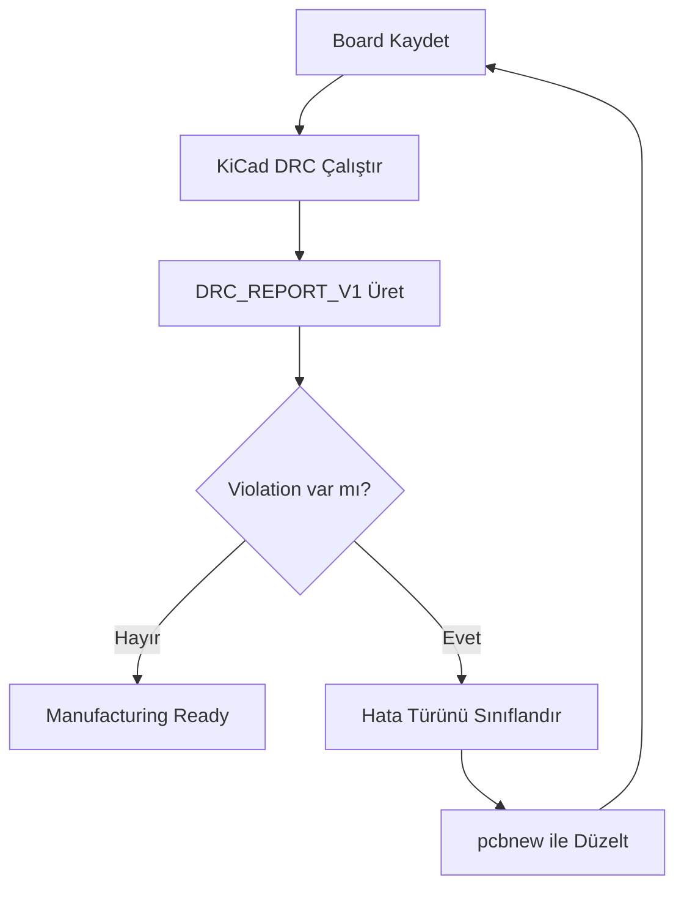

# DRC ve Otonom Düzeltme Döngüsü

## Amaç

Sistemin sadece PCB çizmesi değil, **kendi hatasını okuyup düzeltmesi** hedeflenmiştir.

## Döngü



## DRC Kategorileri

| Kategori | Düzeltme Stratejisi |
| --- | --- |
| clearance | Pad küçültme veya komponentleri ayırma |
| unrouted | Top-layer track çizme, gerekirse layer değiştirme |
| keepout | Objeleri keepout dışına taşıma |
| courtyard | Komponent aralığını artırma |
| drill | Drill clearance / via ölçüsü düzeltme |
| silkscreen | Referans/value yazısını taşıma veya gizleme |

## Faz 4 Gerçek Sonuç

İlk DRC:

```text
94 violations
```

İlk optimizer:

```text
94 -> 2
```

İkinci optimizer:

```text
2 -> 0
```

Son durum:

```text
manufacturing_ready: true
```

## Uygulanan Düzeltmeler

- `U1`, `U2`, `U3`, `U6` placeholder pad ölçüleri küçültüldü.
- DWM3000 için 1.0mm pitch korunarak pad boyutu azaltıldı.
- `OK1-OK2` silkscreen reference/value text gizlendi.
- DRC temizlenince Gerber/drill/position export çalıştı.

## Hard Constraints

> [!danger] DWM3000 RF
> `UWB_RF_50R` neti DWM3000 pin 23 ile SMA arasında olmalıdır. Bu net top layer, viasız ve 50 ohm kontrollü olarak ele alınmalıdır.

> [!warning] AC İzolasyon
> HLK-5M05 ve AC giriş bölgesi için 8mm izolasyon/keepout mantığı korunmalıdır.

## Geliştirme Notu

Şu anki optimizer placeholder footprint’ler üzerinde iyi çalışır. Gerçek üretici footprint’leri geldiğinde optimizer daha az pad boyutu değiştirmeli, daha çok yerleşim/routing stratejisi kullanmalıdır.

İlgili dosya:

```text
engine/layout_optimizer_service.py
```
