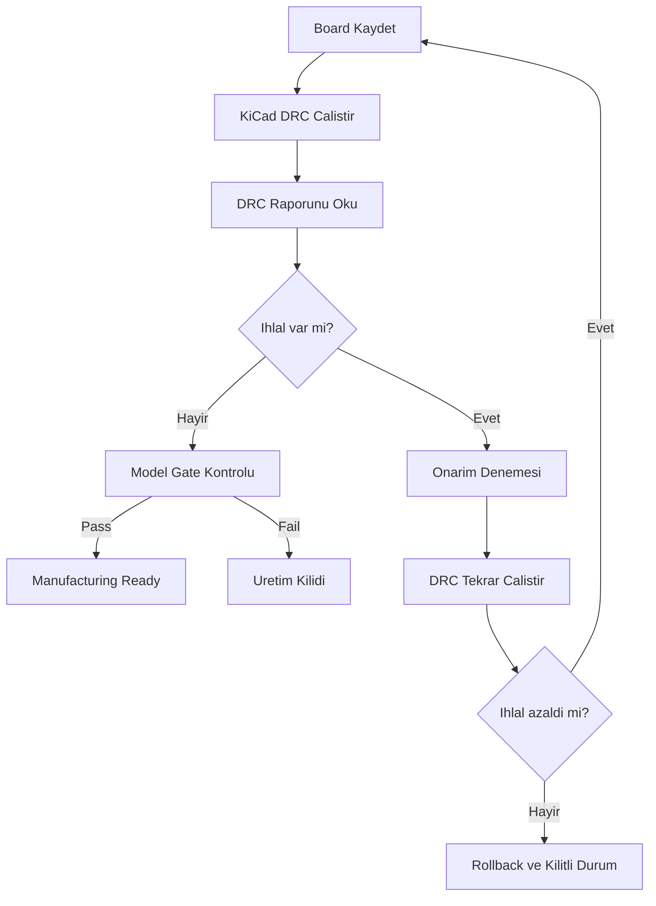

# DRC ve Otonom Duzeltme Dongusu

## Amac

Sistemin amaci sadece PCB dosyasi uretmek degil; KiCad DRC sonucunu okuyup guvenli sekilde iyilestirme denemesi yapmak ve basarisiz/kotulestiren denemeleri geri almaktir.

## Guncel Gercek Sonuc

Son calistirilan akis:

```powershell
.\tool\run_kicad_phase2.ps1 -Export
.\tool\run_layout_optimizer.ps1
```

Son durum:

```text
KiCad: 10.0.3
DRC violations: 0 (0 via_dangling, 0 track_dangling, 0 unconnected, 0 error)
manufacturing_ready: true
dangling temizligi: _prune_dangling_copper, 29 bos via/track silindi
optimizer: hala kapali (mevcut star-routing DRC'yi kotulestiriyor)
```

> [!note]
> DRC=0 sonucu `_prune_dangling_copper` ile elde edildi; ayri layout optimizer (Faz 4) hala devre disi. Eski notlarda gecen `94 -> 2 -> 0`, `331`, `20` gibi sayilar artik gecerli karar kaynagi degildir.

## DRC Kategorileri

Son raporlarda agirlikli sorunlar:

- solder mask bridge
- shorting items
- clearance
- items not allowed
- tracks crossing
- drill / hole clearance
- silkscreen overlap
- no-net pad model sorunlari

## Dongu



## Son Kod Davranisi

- `engine/layout_optimizer_service.py` her iterasyon oncesi aktif PCB yedegi alir.
- DRC sayisi azalmazsa veya artarsa aktif PCB eski haline geri alinir.
- `engine/fabrication_api_service.py` DRC temiz degilse ZIP paketlemez.
- `engine/production_model_gate.py` sentetik/kimliksiz footprint ve asiri no-net pad durumlarini bloke eder.

## Bilinen Kalan Isler (DRC Bloklayici Yok)

- U2 DWM3000 resmi KiCad library footprint kimligi tasimiyor (sentetik).
- Son KiCad DRC: total 0 — Gerber/drill/CPL uretim paketi uretiliyor.
- `REAL_SIMULATION`: RF/AC/thermal/datasheet muhendis incelemesi bekliyor.

## Uretim Kriteri

Uretime gecis icin asgari kosul:

```text
final_violation_count == 0
manufacturing_ready == true
production_model_gate == pass
engineering_readiness == production_candidate
```
