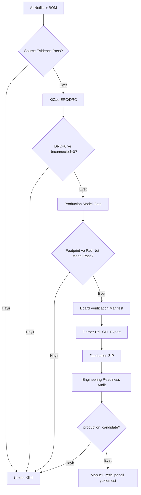

# Faz 5 Uretim Checkout ve Paketleme

Faz 5'in amaci, kaynak kaniti, DRC, production model ve engineering readiness kapilarindan gecmis manufacturing dosyalarini tek bir uretim paketine almaktir. Guncel durumda otomasyon kapilari gectigi icin paket **uretiliyor** (`package_ready`).

> [!success] Guncel Durum
> Son dogrulanmis regenerate DRC total `0`, `manufacturing_ready=true`, source evidence pass, production model pass. Fabrication paketi `package_ready`. Fiziksel siparis oncesi engineering review (`REAL_SIMULATION`) + uretici DFM beklenir.

## Calistirma

```powershell
.\tool\run_fabrication_package.ps1
```

Guncel beklenen sonuc:

```text
status: package_ready
outputs/fabrication/Quantum_Mind_Anchor_v2_4_Production.zip (~18 KB)
```

## Paketleme Kapilari

`engine/fabrication_api_service.py` ve PCBA direct export su kosullari zorunlu tutar:

```text
design_source_evidence == pass
layout_status_file exists
final_violation_count == 0
unconnected_items == 0
via_dangling == 0
manufacturing_ready == true
active PCB contains footprint data
production_model_gate == pass
engineering_readiness == production_candidate
```

Kosullar saglanmadan:

- `outputs/fabrication/Quantum_Mind_Anchor_v2_4_Production.zip` gecerli sayilmaz.
- `outputs/fabrication/fabrication_package.json` guncel uretim kaniti sayilmaz.
- `assets/generated/fabrication_package.json` UI icin uretime hazir kanit sayilmaz.
- PCBA direct export online uretim icin dosya hazir demez.

## Kapi Durumu

Son engineering audit:

```text
overall_status: review_required
readiness_percent: 89
passed: 8/9
blockers: 0
review: 1
```

Gecen kanitlar:

- `DRC_EVIDENCE`: total DRC `0` (0 error, 0 unconnected, 0 dangling). Pass.
- `PCBA_HANDOFF`: DRC temiz. Pass.
- `FAB_ZIP`: DRC temiz. Pass.

Kalan review:

- `REAL_SIMULATION`: RF/AC/thermal/datasheet muhendis incelemesi.

## Dogru Uretim Akisi



## Eski ZIP Uyarisi

Repo icinde onceki kosulardan kalmis ZIP veya fabrication JSON dosyalari bulunabilir. Son gate `blocked` oldugu icin bunlar **guncel uretim onayi degildir**.

## Devam Etmek Icin

1. ~~20 `via_dangling` warning'ini sifirla~~ **Tamamlandi**: `_prune_dangling_copper` ile DRC=0.
2. `REAL_SIMULATION` review maddelerini muhendis dogrulamasiyla kapatip overall'i `production_candidate`'a tasi.
3. DWM3000 (U2) icin resmi uretici footprint'i ekle.
4. Fiziksel siparis oncesi uretici DFM kontrolu yap.
