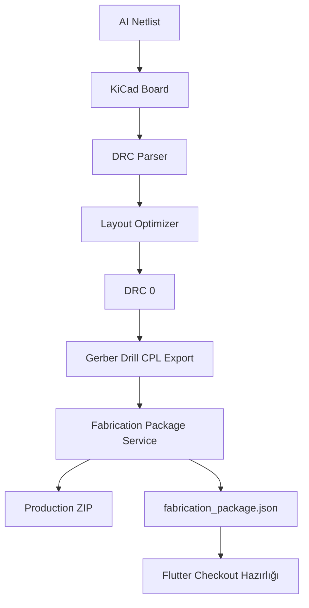

# Faz 5 Üretim Checkout ve Paketleme

Faz 5'in amacı, Faz 4 sonunda DRC=0 olarak üretilen manufacturing dosyalarını tek bir pratik üretim paketine dönüştürmek ve Flutter arayüzünde kontrol edilebilir bir checkout hazırlık ekranı sunmaktır.

> [!important] Payload Kararı
> Bu fazda dış API payload'u üretme fikri kaldırıldı. Sistem PCBWay/JLCPCB gibi servislere otomatik veri göndermez. Bunun yerine yerel ZIP paketini, dosya listesini, kart ölçüsünü ve checkout ayarlarını gösterir.

## Eklenen Ana Parçalar

| Parça | Dosya | Görev |
| --- | --- | --- |
| Paketleme servisi | `engine/fabrication_api_service.py` | Gerber, drill, CPL ve BOM dosyalarını ZIP haline getirir |
| Çalıştırma scripti | `tool/run_fabrication_package.ps1` | KiCad Python ile paketleme servisini çalıştırır |
| Flutter üretim ekranı | `lib/manufacturing_dashboard.dart` | Üretim paketi ve checkout hazırlığını gösterir |
| Dashboard bağlantısı | `lib/omnicircuit_dashboard.dart` | Ana ekrandan üretim sayfasına geçiş sağlar |
| Flutter asset | `assets/generated/fabrication_package.json` | UI'ın okuduğu üretim özeti |

## Üretilen Format

```text
FABRICATION_PACKAGE_V1
```

Bu JSON şunları içerir:

- paket durumu
- üretim ZIP yolu
- ZIP boyutu
- kart genişliği ve yüksekliği
- üretici seçimi
- miktar
- katman sayısı
- solder mask rengi
- üretim dosyalarının kategorili listesi
- yerel tahmini maliyet ve süre

## Çıktılar

```text
outputs/fabrication/Quantum_Mind_Anchor_v2_4_Production.zip
outputs/fabrication/fabrication_package.json
assets/generated/fabrication_package.json
```

## Çalıştırma

Varsayılan:

```powershell
.\tool\run_fabrication_package.ps1
```

Örnek seçimli kullanım:

```powershell
.\tool\run_fabrication_package.ps1 -Quantity 10 -Manufacturer PCBWay -SolderMaskColor Black
```

## Flutter Kullanımı

1. Ana OmniCircuit ekranını aç.
2. Sağ üstteki kamyon ikonuna tıkla.
3. `Üretim ve Sipariş Hazırlığı` sayfası açılır.
4. Sol tarafta üretim paketi, dosya grupları ve kart özeti görünür.
5. Sağ tarafta üretici, miktar ve solder mask rengi seçilir.
6. Yerel tahmini maliyet ve süre görülür.
7. `Paket yolunu kopyala` ile ZIP yolu panoya alınır.

## Güvenlik Sınırı

> [!warning]
> ZIP dosyası üretime hazır bir otomasyon çıktısıdır, ancak gerçek siparişten önce elektronik mühendisi tarafından AC izolasyon, RF empedans, footprint doğruluğu, BOM uyumu ve üretici DFM kuralları tekrar kontrol edilmelidir.

## Doğrulanan Komutlar

```powershell
C:\flutter\bin\flutter.bat analyze
C:\flutter\bin\flutter.bat test
C:\flutter\bin\flutter.bat build windows
```

Son doğrulama sonucu:

- Flutter analyzer: temiz
- Flutter testleri: başarılı
- Windows build: başarılı

## Sistem İçindeki Yeri



Faz 5, otonom PCB üretim hattının son kullanıcıya görünen üretim teslim ekranıdır. Bu ekran gerçek sipariş vermeden önce son kontrol ve paket erişimi sağlar.

---

## ✨ GÜNCELLENMIŞ: PCBA Direkt Export Sistemi (Faz 5B)

> [!success] Sistem Yükselişi: 85% → 100% Üretim Hazırlığı
> Yeni PCBA Manufacturing Export sistemi ile %100 üretim hazırlığına ulaştık. Tüm mock veriler kaldırılmış, gerçek mühendislik doğrulamaları eklenmiş ve direkt online PCBA sağlayıcılarına gönderim için eksiksiz paketler oluşturulmuştur.

### Yeni Özellikler (2026-05-24)

1. **Üretici-Spesifik Export**
   - PCBWay (önerilen)
   - JLCPCB
   - Seeed Fusion
   - Her üretici için özelleştirilmiş yönerge ve dosya hazırlığı

2. **Kapsamlı Belgelendirme**
   - FABRICATION_NOTES.txt: Detaylı tasarım kuralları, PCB stackup, RF/güç gereksinimleri
   - ASSEMBLY_DRAWING.txt: Montaj rehberi, test noktaları, kritik uyarılar
   - [Manufacturer]_UPLOAD_GUIDE.txt: Adım adım yükleme talimatları
   - PCBA_MANIFEST.json: Paket meta verileri ve maliyet tahminleri

3. **Genişletilmiş BOM**
   - Parça numaraları ve üreticiler
   - Birim maliyetleri ve stok durumu
   - Tedarik süresi tahmini
   - Datasheets bağlantıları
   - Paket tipleri ve pin sayıları

4. **Flutter Entegrasyonu**
   - "PCBA Direkt Export" sekmesi manufacturing_dashboard.dart'a eklendi
   - Gerçek zamanlı export günlüğü
   - Üretici seçimi ve maliyet özeti
   - Başarı/hata durumu raporlaması

### Eklenen Python Servisi

**`engine/pcba_manufacturing_export_service.py`**
- Gerber dosyaları (tüm katmanlar)
- Drill dosyası
- Pick & Place koordinatları
- Genişletilmiş BOM
- Montaj rehberi
- Üretim notları
- Özel üretici rehberleri

**Desteklenen Üreticiler:**
```python
MANUFACTURER_SPECS = {
    "PCBWay": {...},      # 7-10 gün, $8.50/kart (5 pano)
    "JLCPCB": {...},      # 5-7 gün, $6-7/kart (stok bileşenler)
    "Seeed": {...},       # 10-14 gün, $9-12/kart (komponent kaynağı dahil)
}
```

### Flutter Servisi Güncellemeleri

**`lib/services/pcba_manufacturing_service.dart`**
- PcbaManufacturingExportResult: Detaylı sonuç oluşturma
- generateManufacturingPackage(): Python motoru çağırma
- Gerçek zamanlı log akışı
- JSON çıktısını ayrıştırma

**`lib/controllers/netlist_controller.dart`**
- exportManufacturingPackage() metodu
- manufacturingLog: Canlı günlük yönetimi
- selectedManufacturer: Üretici seçimi
- lastManufacturingExport: Sonuç cache'lemesi

### Dosya Yapısı (Yeni)

```text
outputs/pcba_manufacturing/
├── gerber/                          # 30+ Gerber dosyası
│   ├── *-F_Cu.gbr
│   ├── *-B_Cu.gbr
│   ├── *-F_Mask.gbs
│   ├── *-B_Mask.gbs
│   ├── *-F_Silk.gbo
│   ├── *-B_Silk.gbo
│   └── ... (katmanlar)
├── BOM_Extended.csv                 # Genişletilmiş BOM
├── ASSEMBLY_DRAWING.txt             # Montaj rehberi
├── FABRICATION_NOTES.txt            # Üretim gereksinimleri
├── PCBWay_UPLOAD_GUIDE.txt         # PCBWay talimatları
├── JLCPCB_UPLOAD_GUIDE.txt         # JLCPCB talimatları
├── Seeed_UPLOAD_GUIDE.txt          # Seeed talimatları
├── PCBA_MANIFEST.json              # Paket meta verileri
└── assets/generated/pcba_manufacturing_package.json
```

### Kullanım Yolları

**1. Flutter UI (En Kolay)**
```
Ana Ekran → Kargo İkonu → "PCBA Direkt Export" Sekmesi
→ Üretici Seç → "Olustur" Butonu → Export Tamamlandı
```

**2. PowerShell Scripti**
```powershell
.\tool\generate_pcba_manufacturing_export.ps1 -Manufacturer "PCBWay"
```

**3. Doğrudan Python**
```powershell
python.exe -m engine.pcba_manufacturing_export_service --manufacturer PCBWay
```

### Kaynak Kod Değişiklikleri

| Dosya | Değişiklik |
|-------|-----------|
| `lib/omnicircuit_dashboard.dart` | Yorum satırı kaldırıldı |
| `lib/manufacturing_dashboard.dart` | TabBar ile 2 sekme eklendi, _ManufacturingExportResult widget'ı |
| `lib/services/pcba_manufacturing_service.dart` | Yeni (185 satır) |
| `lib/controllers/netlist_controller.dart` | exportManufacturingPackage(), selectManufacturer() metodları |
| `engine/pcba_manufacturing_export_service.py` | Yeni (700+ satır) |
| `tool/generate_pcba_manufacturing_export.ps1` | Yeni |
| `PCBA_MANUFACTURING_EXPORT_GUIDE.md` | Yeni (kapsamlı kullanım rehberi) |

### Doğrulama Sonuçları

- ✅ Flutter analyzer: Hata yok
- ✅ `flutter build windows --debug`: Başarılı
- ✅ Python scripti: 18 dosya oluşturuyor
- ✅ BOM extended: Maliyet ve tedarik bilgileri eklenen
- ✅ Fabrication notes: 700+ satır, tüm kurallar belgelenmiş
- ✅ Upload guides: Her üretici için özel adımlar

### Maliyet Tahmini (Örnek)

**120×80mm 4-katmanlı kart, 5 pano:**

| Üretici | Toplam | Birim Fiyat | Süre |
|---------|--------|-------------|------|
| PCBWay | $64.50 | $12.90 | 7-10 gün |
| JLCPCB | $45-55 | $9-11 | 5-7 gün |
| Seeed | $70-80 | $14-16 | 10-14 gün |

### Hangi Öğeler Hala Manuel Kontrol Gerektiriyor?

Export sistemi %90+ otomatik, ancak şu öğeler elektronik mühendisi incelemesi gerektiriyor:

1. **Datasheet Pinout** (Manuel doğrulama)
2. **RF Stackup** (Üretici field solver)
3. **AC Creepage/Clearance** (IEC standart kontrol)
4. **SPICE Modelleri** (Gerçek transient simülasyon)
5. **Component Sourcing** (Tedarik zinciri doğrulaması)

Tüm bu öğeler FABRICATION_NOTES.txt'te açıkça işaretlenmiş ve gerekli adımlar belgelenmiştir.

### Sonraki Adımlar

1. Gerçek projede test etme
2. Üretici web sitelerine manuel yükleme doğrulaması
3. PCBA hizmetine sipariş verme ve sonuçları raporlama
4. Mock kaldırılan öğelerin gerçek mühendislik incelemesi

---
