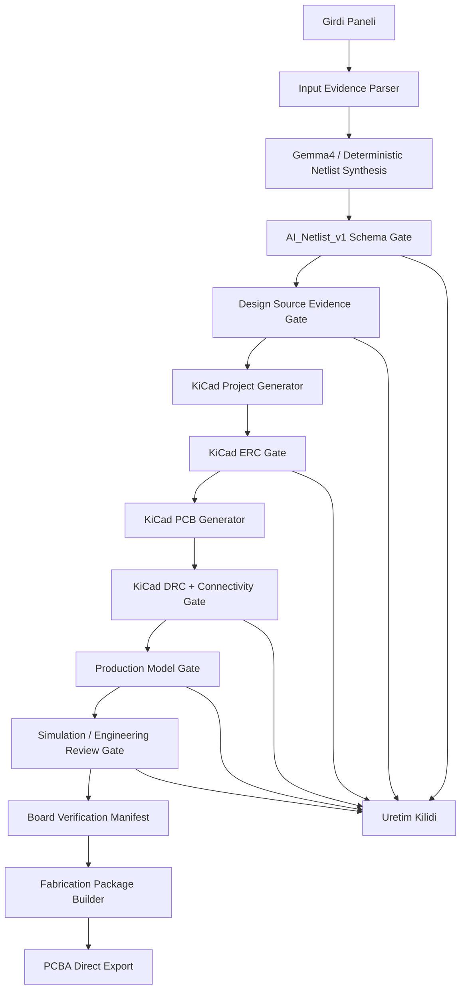

# Kanit Tabanli Uretim Mimarisi

Bu uygulamanin hedefi, kullanicinin verdigi bilgilerden sematik + PCB + PCBA uretim paketi olusturan elektronik devre uretim yazilimi olmaktir. Sistem "AI soyledi" diye uretim onayi vermez; yalnizca kanit zinciri tamamlaninca uretim adayi der.

## Dürüst %100 Tanimi

`%100` burada "her devre fiziksel dunyada kesin calisir" iddiasi degildir. Elektronikte bu iddia datasheet, lab testi, uretici DFM ve prototip olmadan verilemez.

Bu projedeki `%100` tanimi sudur:

```text
Uygulama, eksik veya celiskili kanit varken PCB/PCBA uretim izni vermeyecek.
Uygulama, tum zorunlu kanitlar tamamlanmadan kendini production-ready gostermeyecek.
Uygulama, her raporu ayni board/netlist kosusundan gelen izlenebilir manifest ile baglayacak.
```

## Kusursuz Mimari Hedefi



## 1. Input Evidence Parser

Girdi Paneli uc alandan olusur:

- `Urun Isterleri`: devrenin gorevi, giris/cikislar, calisma modu, guc kaynaklari, ortam.
- `BOM / Komponent Listesi`: Reference, Quantity, Manufacturer, Part Number, Value, Package, Footprint.
- `Teknik Notlar`: katman, stackup, RF, AC izolasyon, uretici tercihi, standartlar, ozel DRC kurallari.

Parser bu alanlari normalize eder:

```text
user_requirements.json
bom_normalized.json
engineering_constraints.json
missing_questions.json
```

Eksik kritik bilgi varsa sistem bunu UI'da sorar ve source evidence gate fail kalir.

## 2. Gemma4 + Deterministic Netlist Synthesis

Ollama/Gemma4, tasarim kararlarini ve netlist adayini uretir. Fakat LLM cikisi yalnizca adaydir.

Zorunlu kurallar:

- JSON schema disina cikan LLM cevabi reddedilir.
- Bos/yetersiz komponent listesi reddedilir.
- Netlerde bilinmeyen referans varsa reddedilir.
- Kritik footprint/pinout emin degilse `requires_user_evidence=true` yazilir.
- Gemma4 yanit vermezse deterministik fallback calisir ama `synthesis_source` acikca yazilir.

## 3. Design Source Evidence Gate

Bu gate su sorulara cevap arar:

- Her net referansi gercek bir komponente gidiyor mu?
- Her kritik komponent BOM'da izlenebilir mi?
- Manufacturer + MPN + package + footprint bilgisi var mi?
- Gruplanmis referanslar (`R10-R13`) tek tek komponentlere acildi mi?
- Kullanicinin isterleri ile uretilen devre arasinda acik celiski var mi?

Fail olursa:

```text
Sematik/PCB deneme uretilebilir.
PCBA/FAB export kilitli kalir.
UI production-ready diyemez.
```

## 4. KiCad Generator

KiCad generator tek sorumlulukla calisir:

- `.kicad_pro`
- `.kicad_sch`
- `.kicad_pcb`
- `sym-lib-table`
- `fp-lib-table`
- project-local footprint library

Uretim seviyesinde kural:

```text
Sentetik footprint yalnizca explicit "prototype placeholder" olarak isaretlenebilir.
Production model gate pass icin footprint library identity zorunludur.
```

## 5. DRC + Connectivity Gate

KiCad CLI tek otoritedir.

Sayilacaklar:

- `violations`
- `unconnected_items`
- `via_dangling`
- clearance/creepage
- drill/hole/annular
- footprint/library
- courtyard/edge

Kabul:

```text
error_count=0
unconnected_items=0
via_dangling=0
manufacturing_ready=true
```

Warning policy:

- Uretimi etkileyen warning blocker olur.
- Sadece dokumantasyon/metadata warning'i manuel review ile gecirilebilir.

## 6. Board Verification Manifest

Her kosu tek manifest uretir:

```json
{
  "schema": "BOARD_VERIFICATION_MANIFEST_V1",
  "generated_at": "...",
  "status": "production_candidate",
  "manufacturing_ready": true,
  "kicad_version": "10.0.3",
  "netlist_sha256": "...",
  "pcb_sha256": "...",
  "bom_sha256": "...",
  "drc_report_sha256": "...",
  "total_findings": 0,
  "unconnected_count": 0,
  "source_evidence_pass": true,
  "production_model_pass": true
}
```

UI, Brainmypcb, layout status, engineering audit ve fabrication package bu manifesti referans almadan "guncel" sayilmaz.

Guncel uygulama durumu (2026-05-26):

```text
outputs/engineering/board_verification_manifest.json
assets/generated/board_verification_manifest.json
manifest gate: aktif PCB ve DRC report hash kontrolu yapar
manifest status: production_candidate, total_findings: 0
PCBA/FAB export: manifest dirty veya blocked ise acilmaz; su an package_ready
```

## 7. 4 Katman PCB/PCBA Mimarisi

Varsayilan uretim mimarisi:

```text
L1 F.Cu   : komponent + sinyal + RF
L2 In1.Cu : solid GND
L3 In2.Cu : power zones
L4 B.Cu   : sinyal escape
```

Kurallar:

- RF net top layer, viasiz, GND referansli.
- GND/power trace-star degil plane + stitching via.
- AC bolge low-voltage plane'lerden izole.
- QFN escape icin fanout via stratejisi.
- Router candidate sonucunu DRC ile kanitlamadan board'a kalici yazmaz.

## 8. PCBA/FAB Export

PCBA direct export ve fabrication ZIP su kosullar olmadan calismaz:

```text
manifest current
design_source_evidence=pass
ERC pass
DRC pass
production_model_gate=pass
engineering_readiness=production_candidate
```

ZIP icinde zorunlu dosyalar:

- Gerber
- drill
- BOM
- CPL / pick-and-place
- assembly drawing
- fabrication notes
- ERC report
- DRC report
- board verification manifest

## 9. Uygulama Davranis Kurali

UI metinleri asla yanlis guven vermeyecek:

- `blocked`: uretime gonderme.
- `review_required`: otomasyon temiz ama muhendis onayi gerekiyor.
- `production_candidate`: uretim paketi hazir, yine de uretici DFM ve prototip tavsiye edilir.

## 10. P0 Uygulama Sırası

1. Source evidence normalizasyonu: `K2`, `R10`, MPN/BOM uyumsuzluklari. **Tamamlandi.**
2. Board verification manifest. **Tamamlandi.**
3. Rapor senkronizasyonu: Brain/UI/audit/layout status ayni manifestten beslensin. **Kismen tamamlandi; engineering/PCBA/FAB manifest gate'e baglandi.**
4. 4-katman routing ve via modelinin DRC=0 hedefiyle yeniden tasarimi. **DRC=0 saglandi**: `_prune_dangling_copper` zone fill sonrasi bos via/track temizligi (T-junction farkindalikli). Son DRC 0 bulgu, 0 error, 0 unconnected. (Kalite: router'in basta dogru fanout/stitching uretmesi hala iyilestirme alani.)
5. PCBA/FAB export stale-package kontrolu. **Tamamlandi; manifest blocked ise export acilmaz.**
6. Uretim kabul testleri: bos netlist, stale report, DRC dirty, missing BOM, synthetic footprint, DRC=0 smoke. **Kismi**: DRC=0 smoke gercek kosuda dogrulandi.
