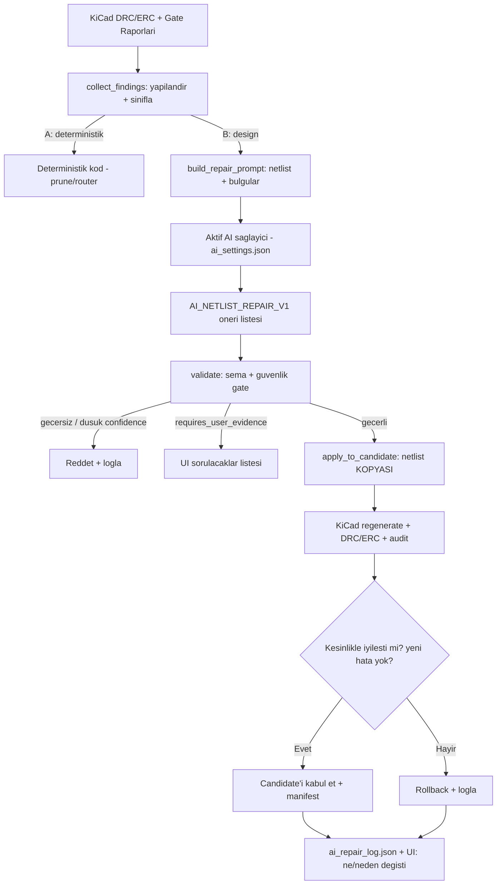

# AI Tamir Dongusu (Closed-Loop AI Repair)

Bu not, OmniCircuit'in **kapali-dongu AI tamir** akisinin mimarisini ve durustluk kurallarini tanimlar. Amac: KiCad/gate hatalarini yapay zekaya verip **sema-dogrulanmis** tamir onerisi almak, yalnizca gecerli ve **iyilestiren** degisiklikleri uygulamak.

> [!important] Temel Kural
> **AI onerir, deterministik kapilar + KiCad kanitlar.** Hicbir AI ciktisi dogrulanmadan board'a yazilmaz. LLM ciktisi yalnizca adaydir; KiCad CLI ve gate'ler tek otoritedir. Bu, [[01 - Sistem Özeti|real-not-mock]] ilkesinin geregidir.

> [!note] Saglayici-Bagimsizlik
> Sistem hangi AI'a sabitlenmez. Her zaman `engine/ai_settings.json`'da **aktif olan** saglayici/model kullanilir (`OllamaClient` otomatik okur): ollama/gemma, gemini, openai, nvidia, claude. Kullanici herhangi bir API ile baska bir model baglayabilir; tamir dongusu degismeden calisir. Asagidaki "gemma4" ornekleri yalnizca su anki aktif ayardir, zorunlu degil.

## Iki Tur Hata — AI Nerede Ise Yarar?

| | A) Deterministik / geometrik | B) Muhendislik karari / bilgi |
| --- | --- | --- |
| Ornek | via_dangling, clearance, unconnected, pin->pad, koordinat | yanlis komponent, eksik decoupling/yardimci devre, BOM/MPN uyumsuzlugu, datasheet pinout, net mantik hatasi |
| Dogru cevap | Tek — kesin matematik/KiCad | Cok — muhendislik yargisi |
| LLM guvenilir mi? | HAYIR (koordinat halusinasyonu) | EVET (gercek deger katar) |
| Cozucu | Deterministik kod (`_prune_dangling_copper`, router) | **AI Tamir Dongusu** (bu not) |

AI tamir dongusu **B kategorisi** hatalarini hedefler. A kategorisi icin AI yalnizca *teshis/strateji* onerebilir; duzeltme + kanit deterministik kalir.

## Ortam (2026-05-26)

```text
Saglayicilar (engine/ollama_client.py): ollama, gemini, openai, nvidia, claude
Aktif ayar: engine/ai_settings.json -> OllamaClient bunu okur (provider/model/base_url/api_key)
Su anki aktif: provider=ollama, model=gemma4 (Ollama calisiyor; gemma4:latest 9.6 GB, gemma:2b mevcut)
Not: provider degisirse (orn. gemini/claude/openai) tamir dongusu AYNEN calisir.
```

## Akis



## Oneri Semasi — `AI_NETLIST_REPAIR_V1`

LLM yalnizca sinirli (bounded) operasyon listesi dondurur:

```json
{
  "schema": "AI_NETLIST_REPAIR_V1",
  "operations": [
    {
      "op": "add_component | remove_component | modify_component | add_net | modify_net | remove_net",
      "target": "U3 veya net adi",
      "fields": { "value": "...", "part_number": "...", "footprint": "...", "pins": ["U3.VCCA", "C93.1"] },
      "reason": "Neden gerekli",
      "confidence": 0.0,
      "requires_user_evidence": false
    }
  ]
}
```

## Dogrulama (Deterministik Gate)

`validate_proposals` su kurallari uygular:

- `op` izinli kume icinde mi?
- Hedef ref/net gercek mi (veya yeni gecerli ref formati mi)?
- `pins` gercek komponentlere isaret ediyor mu?
- MPN/footprint alan formati gecerli mi?
- `confidence` esigin altindaysa veya AC/izolasyon gibi guvenlik-kritik netlere evidence'siz dokunuyorsa -> **otomatik uygulanmaz**, `requires_user_evidence=true` ile UI sorulacaklar listesine gider.

## Kabul/Rollback

- Degisiklikler once netlist **kopyasina** uygulanir (canli dosyaya degil).
- KiCad regenerate + DRC/ERC + engineering audit candidate uzerinde kosar.
- Candidate yalnizca **kesinlikle iyilesirse** (daha az bulgu / bir gate pass'e doner) ve **yeni error uretmezse** kabul edilir; aksi halde rollback.
- Bu, [[05 - DRC ve Otonom Düzeltme Döngüsü|optimizer]] icin tasarlanan candidate-branch ilkesiyle aynidir.

## Durustluk Garantileri

- `synthesis_source` / `repair_source` ve `provider/model` her zaman acikca loglanir.
- Hicbir AI degisikligi re-verify iyilestirmeden canli board'a yazilmaz.
- `requires_user_evidence` maddeleri asla sessizce varsayilmaz; UI'da sorulur.
- Her tamir kosusu board verification manifest hash'ine baglanir.

## Cikti Dosyalari

```text
outputs/engineering/ai_repair_log.json        (AI_REPAIR_RUN_V1)
outputs/engineering/input_evidence_report.json (INPUT_EVIDENCE_V1 + missing_questions)
outputs/phase1/AI_NETLIST_V1.candidate.json    (gecici candidate)
assets/generated/ai_repair_log.json            (UI icin)
assets/generated/input_evidence_report.json    (UI icin)
```

## Iliskili Kod

```text
engine/ai_repair_service.py          (yeni — collect/validate/apply/reverify motoru)
engine/input_evidence_validator.py   (yeni — Girdi Paneli BOM<->netlist kanit dogrulama)
engine/netlist_source_normalizer.py  (BOM value+MPN hizalama — _align_component_metadata)
engine/ollama_client.py              (cok-saglayicili LLM koprusu)
engine/cognitive_netlist_generator.py (AiNetlist semasi)
engine/drc_parser.py                 (DRC_REPORT_V1 yapilandirma)
test/ai_repair_validation_test.py    (dogrulama gate testi 9/9)
```

## Durum (2026-05-26)

- [x] `engine/ai_repair_service.py` cekirdek (sema + collect + classify + build_prompt + validate + apply + log)
- [x] LLM cagrisi aktif saglayici ile baglandi (OllamaClient — sabitlenmez). Dry-run: provider=ollama/gemma4 dogru okundu.
- [x] Aktif saglayici (gemma4) ile uctan uca dry-run: REAL_SIMULATION review icin gemma4 BOS operasyon dondurdu (halusinasyon yok) -> `no_valid_operations`. Durust.
- [x] Dogrulama gate testi (`test/ai_repair_validation_test.py`) — 9/9 PASS:
  - gecerli decoupling net + MPN duzeltmesi -> accepted
  - guvenlik-kritik AC_L_PROTECTED -> needs_evidence (UI'ya sorulur)
  - dusuk confidence / olmayan komponent / bilinmeyen pin -> rejected
  - candidate uygulanir, canli netlist deepcopy ile korunur
- [x] **Girdi Paneli kanit dogrulayici** (`engine/input_evidence_validator.py`): BOM<->netlist tutarlilik. Gercek veride 2 error (J1/J2 orphan pin), 2 warn (R20/R21 MPN), 47 review (kapsama) buldu. ai_repair_service'e "design finding" olarak baglandi.
- [x] **candidate re-verify + accept/rollback**: `reverify_candidate` candidate'i CANLI netliste yazip KiCad ile yeniden uretir; regresyon yoksa (DRC=0) ve girdi hatasi azaldiysa/deterministik fix varsa kabul, yoksa rollback. Gercek kosu: R20/R21 duzeltmesi kabul edildi (board 0->0, input errwarn 4->2).
- [x] **Deterministik BOM hizalama** (kok-neden): `netlist_source_normalizer._align_component_metadata` her build'de mevcut komponent value/MPN/uretici'sini BOM'a hizalar (footprint'e dokunmaz). Sonuc: R20 IRQ pull-up = 10K, R21 EXT_TX = 33R (onceden yanlis 100R idi) — kalici. DRC=0 korundu, input warn 2->0.
- [x] **UI entegrasyonu**: Flutter dashboard "Sanal Laboratuvar" panelinde `_InputEvidencePanel` — girdi denetimi durumu (error/warn/review) + kullaniciya "sorulacaklar" listesi gosterilir. `InputEvidenceReport` modeli + controller loader eklendi. `flutter analyze`: temiz (No issues).
- [x] **Tool runner**: `tool/run_ai_repair.ps1` (-Apply ile re-verify). Uctan uca calisti.

### Dogrulanmis Sonuc (2026-05-26)

```text
Girdi hatasi tespiti + duzeltme dongusu calisiyor:
- input_evidence: error 2 (J1/J2 orphan), warn 0 (R20/R21 cozuldu), review 47
- R20=10K, R21=33R BOM'a hizali (normalizer her build'de korur)
- AI repair: gemma4 MPN duzeltmesi onerdi -> gate kabul; J1.L (AC mains) -> guvenlik-kritik -> kullaniciya soru (otomatik eklemez)
- re-verify: board DRC 0->0, kabul; canli netlist guncellendi
- DRC=0, manufacturing_ready=true korundu
```

Onemli durustluk notu: J1 (AC sebeke) ve J2 (SMA RF) orphan'lari guvenlik-kritik oldugu icin
sistem OTOMATIK eklemez; kullanici onayina (requires_user_evidence) yonlendirir. Bu dogru davranistir.

### Calistirma

```powershell
# Tool runner (girdi dogrulama + AI tamir). -Apply ile re-verify edip canliya yazar.
.\tool\run_ai_repair.ps1            # dry-run (oneri + dogrulama)
.\tool\run_ai_repair.ps1 -Apply     # candidate'i KiCad re-verify ile dogrula, regresyon yoksa uygula

# Dogrulama gate testi
& "C:\Program Files\KiCad\10.0\bin\python.exe" test\ai_repair_validation_test.py
```

Cikti: `outputs/engineering/ai_repair_log.json` + `assets/generated/ai_repair_log.json` (AI_REPAIR_RUN_V1).

Ilgili: [[08 - Sonraki İşler]], [[11 - Kanit Tabanli Uretim Mimarisi]], [[10 - Mühendislik Gerçeklik Kapısı]]
